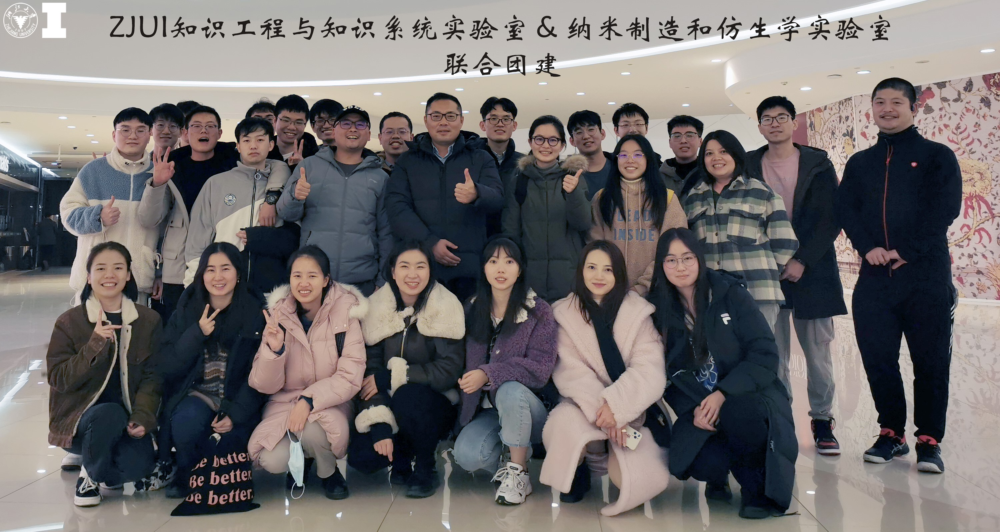

2022年1月9日，ZJUI知识工程与知识系统实验室同纳米制造和仿生学实验室共同组织联合团队建设活动。本次团建活动是首次跨团队的新年团建活动，旨在积极响应浙江大学国际联合学院“多学科、全方位、多角度”的科研理念，以团建活动为载体不同学科的交叉融合更加高效。本次活动以团队聚餐的形式展开，团队负责人王宏伟老师、胡欢老师及实验室成员共28人参加本次团建活动。

  

王宏伟老师带领知识工程与知识系统实验室围绕知识图谱、自然语言处理、智能设计与制造等领域开展研究活动，胡欢老师带领的纳米制造和仿生学实验室以电子、机械、材料、生物医学为主要研究学科。团建活动中，不同实验室的成员间相互交流，彼此了解学科前沿发展，在轻松愉悦中建立起深厚的友谊。王宏伟老师与胡欢老师同各个实验室成员进行交流，不仅对各自团队一年的工作进行回顾，更是将传统的团建活动升华成一场跨学科学术讨论和问题凝练的盛会。

整个团建活动氛围轻松，同学们在结束一年的忙碌后，聚在一起畅想未来，思想全方位碰撞。寄此为种，激发ZJUI的研究生工作氛围和创新活力。本次团建活动也在紧张的科研工作之余，为同学们提供了一个放松的机会，让实验室成员以最佳的状态投身新一年的工作与学习中。
