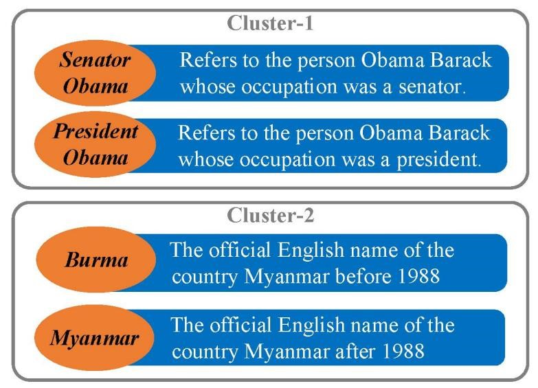
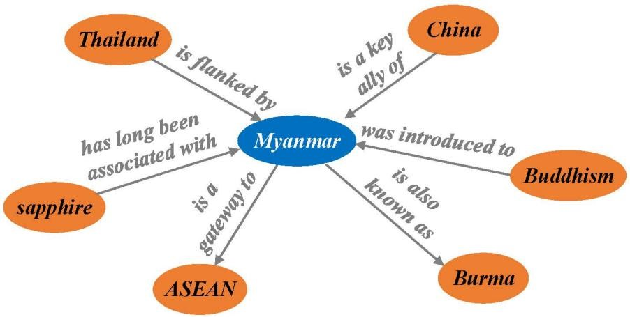
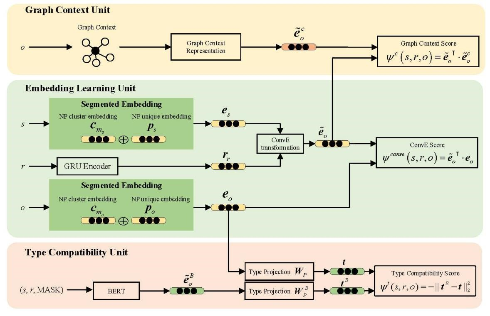
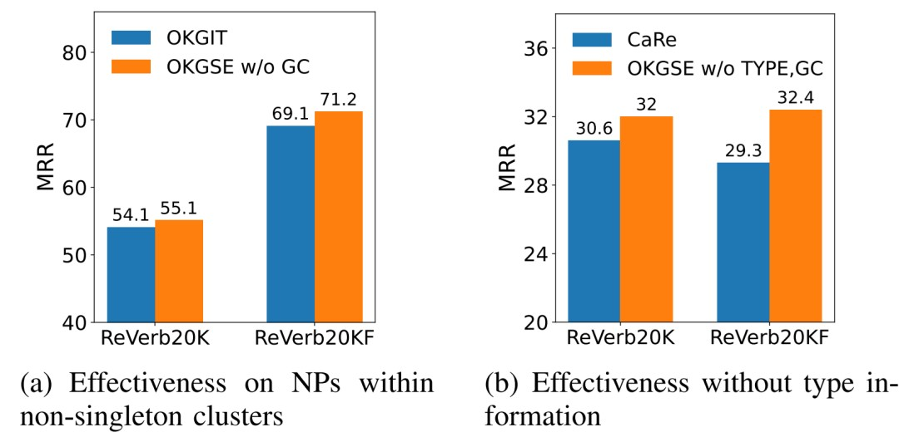

**摘要**  开放知识图(OpenKG)链接预测对于在问题回答和文本理解等应用程序中使用OpenKG非常重要。OpenKGs中的名词短语(NPs)和关系短语没有被规范化，这使得OpenKG的链接预测具有很高的挑战性。解决这一问题的现有方法将规范化信息注入到知识图嵌入模型中。然而，它们仍然不能充分利用NPs的语义。首先，两个不同的NPs，即使是指同一个实体，也可以携带不同版本的信息，这已经被以前的方法忽略了。其次，OpenKGs中NPs的邻域信息尚未被利用，其中包含了丰富的链路预测信息。基于这些观察结果，我们提出了OpenKG分段嵌入(OKGSE)方法。具体来说，为了充分捕获属于同一聚类的NPs的差异，我们学习了NP聚类和NP的单独嵌入部分。同时，我们通过将图上下文整合到语义匹配得分函数中来利用邻域信息。跨四个基准测试的广泛实验表明，OKGSE可以实现最先进的性能，并有效地捕获每个NP的独特语义。

1.  研究背景

开放知识图(OpenKG)由（名词短语、关系短语、名词短语）三元组组成。由于开放信息提取(OpenIE)工具的有效性，OpenKGs可以很容易地从一个特定于领域的语料库中构建出来。然而，openkg通常是稀疏的，而且远不完整。因此，预测缺失链接的任务，即链接预测，对于在回答、文本理解和等应用中使用OpenKGs非常重要。

与本体论知识图(KGs)不同，OpenKGs中的名词短语(NPs)和关系短语(RPs)没有被规范化，即多个NPs或RPs可以分别指同一现实世界的实体或关系。这给OpenKG链路预测带来了重大挑战。尽管以前的方法一定程度上缓解了该问题，但NPs的语义尚未得到充分利用。一方面，同一NP集群内的NPs可以携带关于同一实体的不同版本的信息，这被现有的方法忽略了。另一方面，以往的方法没有利用NPs的邻域信息，这包含丰富的信息进行链路预测。
基于这些观察结果，我们提出了OKGSE，一种基于分割嵌入实现开放图谱链路预测的方法。

2.  研究内容
  
如图1所示，同一集群内的NPs可以携带关于同一底层实体的不同版本的信息，这已经被以前的方法忽略了。忽略这种差异可能会导致链路预测的失败。以查询（？，竞选，总统）为例，奥巴马参议员比奥巴马总统是更令人满意的答案，尽管奥巴马参议员和奥巴马总统属于同一个群体。同时，如图2所示的邻域信息有利于链路预测，现有方法没有利用。基于这些观察结果，我们开发了OKGSE来改进OpenKG链路预测，该方法结构如图3所示。
 

图1  实体提及群体示例图

图2  实体提及邻居节点示例图

 

图3  OKGSE方法结构图

OKGSE的体系结构由嵌入学习单元、图上下文单元和类型兼容性单元三个组成部分组成。首先，在嵌入学习单元中，我们学习NPs的分段嵌入和RPs的GRU编码器。我们将NP嵌入分为两部分，分别学习NP聚类和NP的信息。然后在学习到的嵌入上计算ConvE分数。其次，在图上下文单元中，我们设计了图上下文得分，从主体NP-RP对与对象NP的邻居信息之间的匹配度来衡量三元组的合理性。第三，在类型兼容性单元中，我们利用了[10]中提出的隐式类型信息。计算类型兼容性得分是为了衡量研究对象NP-RP对和研究对象NP之间的类型兼容性。最后，将上述三个分数结合在一起，以衡量三重测试的合理性。

图4展示了本文方法与已有方法的对比。由图中(a)我们可以看到，OKGSE的性能明显优于OKGIT。这证明了在非单例集群中分段嵌入的有效性。此外，从图中(b)我们可以观察到，即使没有任何类型的信息，我们的模型在两个数据集上都取得了比CaRe更好的结果。这说明了分段嵌入对链路预测的有效性。
 

图4  本文方法OKGSE与已有方法对比

3.  研究结论
  
OpenKG的链接预测是一项具有挑战性的任务，因为OpenKG中的NPs和rp并没有被规范化。现有的方法侧重于注入规范化信息或引入类型信息来解决这个问题。然而，它们忽略了同一集群内NPs的差异性，导致了对NP语义的利用不足。同时，以往的方法没有利用邻域信息，其中包含丰富的信息进行链路预测。为了填补这一空白，我们提出了OKGSE，一种利用分段嵌入和图上下文来改进OpenKG链路预测的方法。我们将NP嵌入分为两部分，即NP簇嵌入和NP唯一嵌入，以在注入规范化信息的同时充分捕获NP语义。此外，为了利用邻域信息，我们将图上下文集成到我们的得分函数中。在四个基准上的大量实验表明，与现有方法相比，我们的模型可以达到最先进的性能。此外，实验表明，我们的模型在学习同一集群内的NPs的不同语义方面是有效的。
