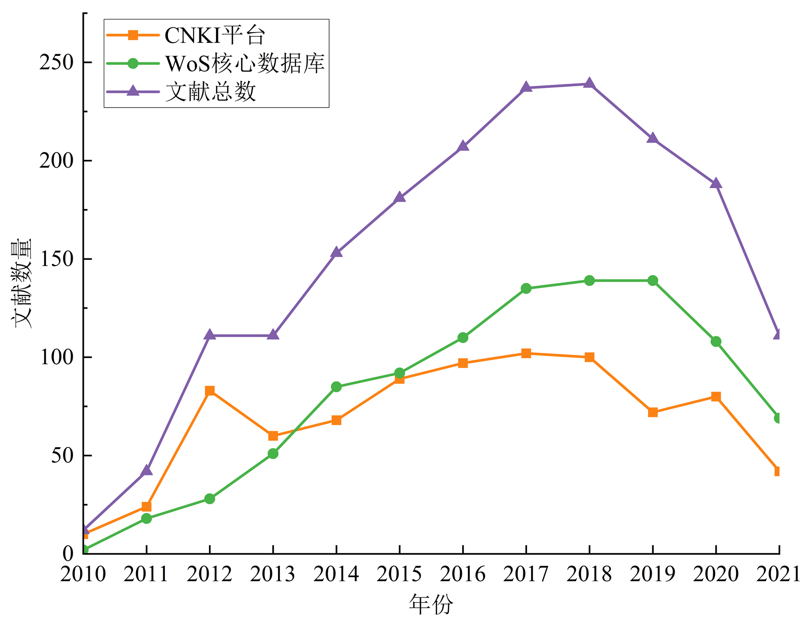
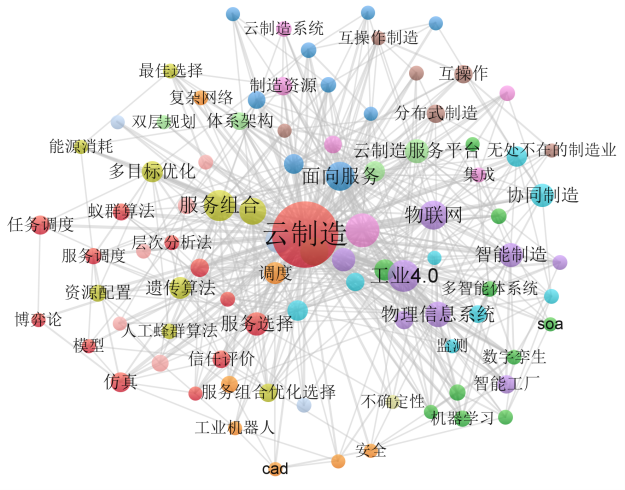
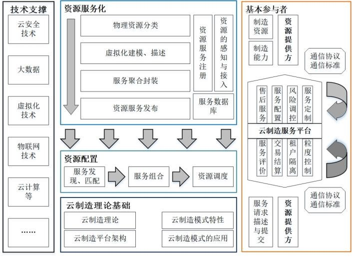
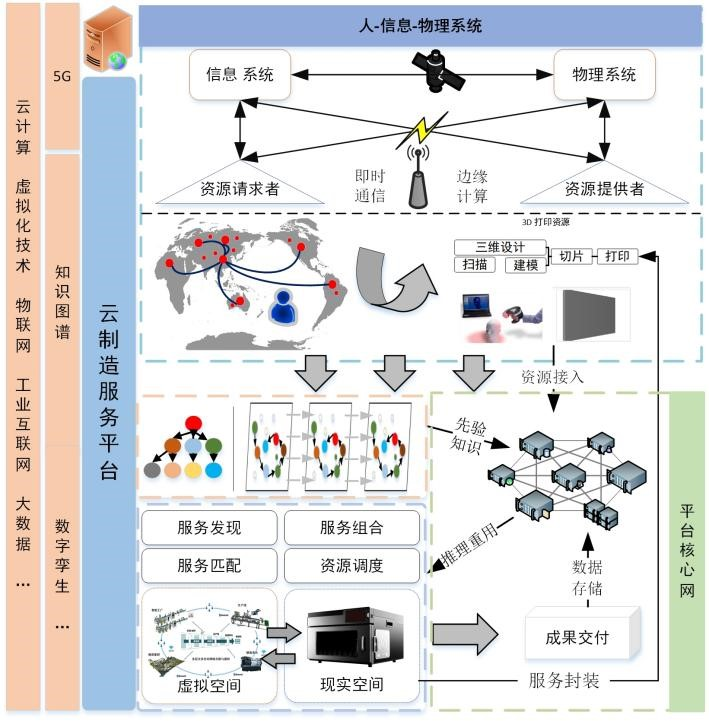

ZJU知识工程与知识系统课题组成员王宏伟、张宇飞和燕凯宏围绕资源流对云制造相关研究展开定性和定量分析，准确把握云制造研究现状与发展趋势，独创性地结合高新技术提出云制造新模式，并完成论文《基于资源流的云制造研究综述》的撰写。论文已被《华中科技大学学报（自然科学版）》录用。《华中科技大学学报（自然科学版）》是由华中科技大学主办、教育部主管的综合性科学技术类学术刊物，已被北大核心期刊目录及包括《EI Compendex》在内的30余家权威文摘期刊和重要数据库收录。

<h4 style="text-align:center;">摘要</h4>

为全面了解云制造的研究现状以及未来发展趋势，以云制造系统运行过程中的资源流为主线对其研究成果进行综述。结合文献计量法和引文分析法，对从Web of Science与中国知识基础资源数据库检索到的文献成果进行定量和定性分析。首先阐述云制造理论研究基础，然后分析资源流动过程中资源服务化和资源配置阶段的研究现状，总结各个阶段的研究现状和不足；讨论新技术的应用及面临的挑战，并对未来的研究方向作展望。

<h4 style="text-align:center;">1.  研究背景</h4>

制造业是强国之基，从根本上体现一个国家的综合实力和国际竞争力。资源作为云制造环境中的核心元素，以数字的形式进行通信与交互，以服务的形式被访问与管理，其实质可被归纳为社会市场中不同场景下，资源在接入、配置与服务等过程中发生的一系列状态、位置、价值、能量等的变化。本文以云制造为研究对象，以资源流为研究主线展开云制造研究的综述，对掌握云制造的当前现状、把握云制造的发展趋势具有重要的现实意义。

<h4 style="text-align:center;">2.  研究内容</h4>

本文对比当前已有的综述文献，综合定性分析与定量分析，对2010-2022年期间云制造领域发表的相关文献展开综述研究。

  <!-- 

    
     
    
图1  云制造相关文献数量的增长趋势图

  
 -->
  
  
图1  云制造相关文献数量的增长趋势图

  
  
图2  云制造研究相关术语分布图

本文创新性围绕云制造系统运行过程关键主线——资源流，如图3所示，从云制造理论基础、云制造资源服务化与资源配置等方向分析云制造研究发展的现状与不足。

  
  
图3  云制造系统运行原理

云制造作为多技术融合的体系，整合工业互联网、云计算为基础技术，结合5G技术、知识图谱、数字孪生等高新科学技术，以3D打印为例，构建如图4所示的云制造模式新体系。

  
  
图4  云制造新模式案例

<h4 style="text-align:center;">3. 研究结论</h4>

云制造模式以共享、协作、服务等为核心理念，彻底打破传统制造业的束缚，为全球化制造提供高效协作和资源共享的新模式。云制造模式提供产品设计、产品研发、生产制造、产品检测、物流配输、运维管理、售后服务等产品全生命周期服务，建设一站式解决的协同制造平台，打造制造与服务相结合的产业模式，打破传统制造业的时间和空间上的限制，最大化降低资源管理运营成本，提高社会资源利用率。
