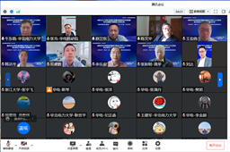
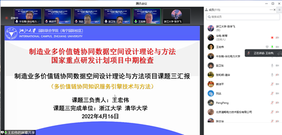
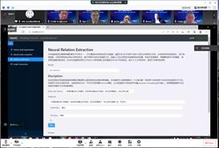

国家重点研发计划“制造业多价值链协同数据空间设计理论与方法”课题中期检查会顺利召开
4月16日，国家重点研发计划“网络协同制造和智能工厂”重点专项“制造业多价值链协同数据空间设计理论与方法”课题中期检查会议以线上的形式顺利召开。莅临本次会议检查指导的专家包括科技部责任专家浙江理工大学陈文华副校长、科技部责任专家同济大学赵卫东教授、科技部专家中国机电一体化技术应用协会副秘书长黄永华研究员、中国科学院大学吴德胜教授、北京化工大学余乐安教授、北京国嘉瑞会计事务所徐胜怀所长，各个课题组负责人及主要科研骨干等100余人也参加本次会议交流学习。浙江大学知识工程与知识系统团队有10余名老师和同学参加本次会议，其中团队负责人王宏伟教授作为课题三负责人对课题的中期进展进行汇报。

  

会上，华北电力大学科学技术研究院张充副院长对莅临参会的各位领导、专家等与会人员表示热烈欢迎，并对本次中期检查会议相关情况进行介绍。项目负责人华北电力牛东晓教授对整个项目在过去的一年半的总体进展情况进行介绍，王宏伟教授代表课题三对“多价值链协同知识服务引擎技术”课题中期取得的进展进行汇报。本课题由浙江大学和清华大学组成的联合团队共计20余名研究人员进行攻关，聚焦面向制造业多价值链协同过程中的知识挖掘和服务理论和方法进行攻关。在过去一年半里取得非常好的进展，在IEEE Trans. on Industrial Informatics、Applied Soft Computing、ISA Transactions等期刊和会议上发表论文近10篇，申请发明专利1项、软件著作权2项，完成两项软件构件开发，指导毕业博士一人、硕士两人。
随后，四个课题汇报完毕并开始进行软件演示，软件演示采用播放预录制视频的方式进行。王宏伟教授演示“多价值链知识抽取及图谱构建软件V1.0”和“多价值链协同知识服务引擎基础平台V1.0”的软件功能。其功能主要如下：面向制造业多价值链协同数据及面向Web服务需求，以多价值链协同知识为目标对象，以知识图谱为知识服务技术支撑，搭建多价值链协同知识服务基础平台，实现用户及其个性化知识管理。

  

  
  

  
四位课题负责人演示工作结束后，认真倾听专家组根据汇报内容提出的宝贵意见，并对各位专家提出的问题进行详细解答。专家组陈文华教授、余安乐教授、吴德胜教授和黄永友教授围绕各个课题的研究内容、研究指标、标志性成果、研究相关性、学科融合、软件集成、应用场景、研究价值等方面提出宝贵建议，项目组特邀财务专家徐胜怀所长就目前项目的经费执行情况进行了指导和说明。最后，专家组对当前项目各课题的研究工作、研究任务、规范管理给予肯定，一致认为课题三出色完成课题的研究任务和目标。同时，专家组也就科技部布置的中期检查工作提出更高要求，建议项目组挖掘项目整体的研究特色及成果亮点，保证高标准、高质量、高水平地完成研究工作。
“制造业多价值链协同数据空间设计理论与方法”项目隶属于国家重点研发计划“网络协同制造和智能工厂”重点专项，是国家对十四五期间制造业数字化转型的一个重要布局，能够为十四五期间我国产业升级和制造业发展产生重要支撑。本项目围绕我国网络协同制造和智能工厂的重大发展需求，从数据协同、智能决策、知识挖掘、管理优化等方面开展数据空间设计理论与方法的研究，建设重大理论成果，并对电力装备制造业首先开展应用示范，以大幅强化企业生产经营能力，不断提升我国制造业的创新力与竞争力。

