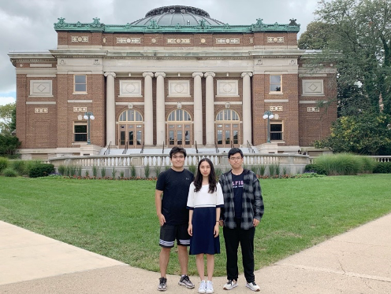

ZJUI 2017级电子与计算机工程专业本科生杜扬恺、黄家源、陶舒婷2019年暑期完成的合作论文**Knowledge Graph Construction and Reasoning for Intelligent Maintenance of Power Plants**，日前已被国际学术会议**The International Conference on e-Business Engineering (ICEBE)正式收录**，指导老师为**王宏伟**副教授。本次国际会议根据同行评议审稿结果从近百篇论文中仅选出13篇推荐为长文发表，该论文一举成为13篇长文之一并获得审稿专家一致好评。

  

