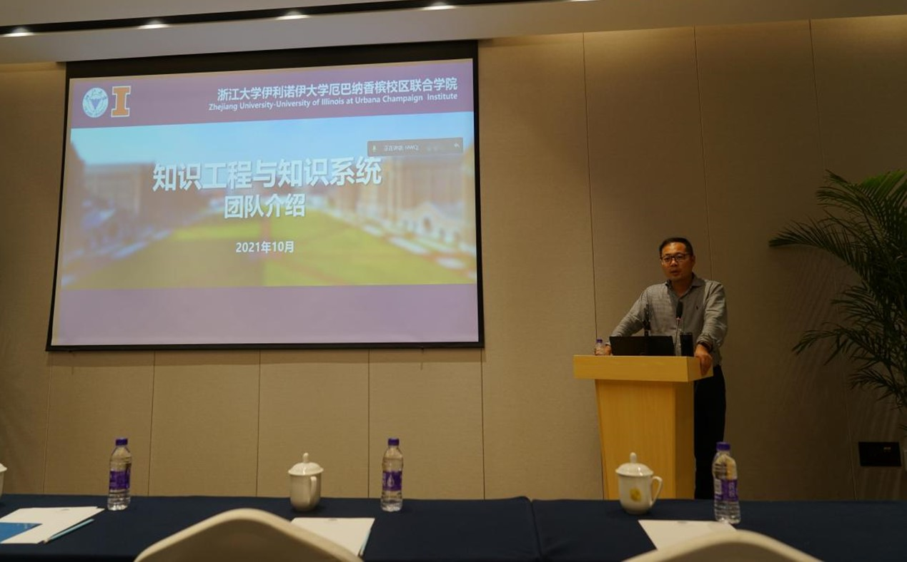

2021年10月17日下午14：00，浙江大学知识工程与知识系统团队王宏伟老师和全体成员在杭州召开2021年秋季团队组会和团队建设会议。

参加本次活动的人员包括团队负责人王宏伟老师、北京科技大学彭功状老师、清华大学博士生彭鹏以及知识工程与知识系统团队全体成员，采用线上线下结合的方式，举办一场独特的团队建设及组会活动。

首先，王宏伟老师对团队的基本情况进行了介绍，包括团队的基本成员、团队的研究方向以及主要研究课题。此外，王宏伟老师对团队齐心协力成功组织科技部重点研发项目2021年度督导会的筹备工作表示肯定，各团队成员团结合作、互相配合的工作方式充分体现了团队的凝聚力和支撑力。同时王老师也提出希望团队全体成员要明确自己的路线与研究方向，多多开展团队内协作，在各位成员的努力下将团队建设得更好。

  

随后，团队开展定期的组会，由科研助理张宇飞进行知识分享，团队项目相关负责同学谢庭玉、李梦璇、王海波、张键等分别进行项目进度的汇报与规划，彭功状老师和王宏伟老师从项目及科研背景出发，对项目工作的开展给予指导。

  

为促进团队成员之间的相互了解，每位成员进行了简短的自我介绍，包括个人的研究方向、兴趣爱好等。通过交流，发现相同兴趣爱好的伙伴，也能为科研之余的生活增添不少的乐趣。最后，王宏伟老师为各位同学提出希望和要求，针对如何成长为一名不断成长进步的研究生给出具体建议。

  

通过这样一次团队建设会，促进了成员之间的交流，增强了成员之间的熟悉度，为团队各项工作的顺利推进提供了一个良好的氛围。
